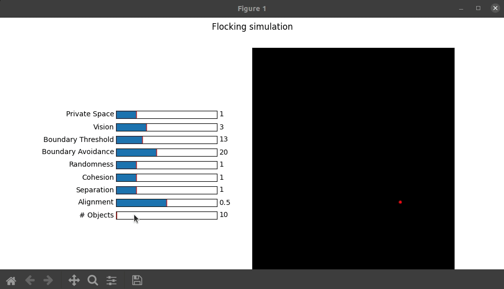

# Flocking simulation
([Modified Boids algorithm](https://en.wikipedia.org/wiki/Boids)) using CuPy. Skoltech HPPL2020 Course Final project. 
[Video presentation of the project](https://youtu.be/BW3XSfYKM88)



## About the project
This is a CuPy (vectorised for GPU) implementation of Modified Boids algorithm which allows
to simulate a 2D [flocking](https://www.youtube.com/watch?v=V4f_1_r80RY).
A little GUI, where you can play with different
parameters of the model, is available.

### The equations gathering the movement could be seen below


## Getting Started

- install matplotlib and cupy (compatible with your cuda version) python packages
- run the simulation with ```python run plotting.py```
- enjoy 
